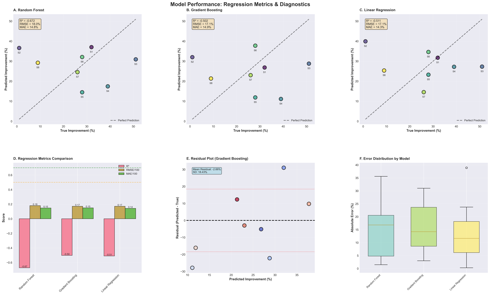
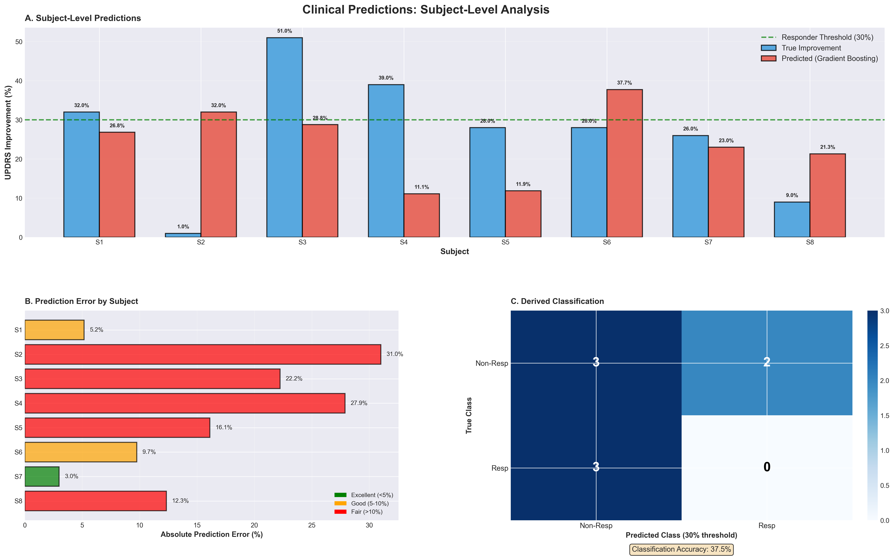
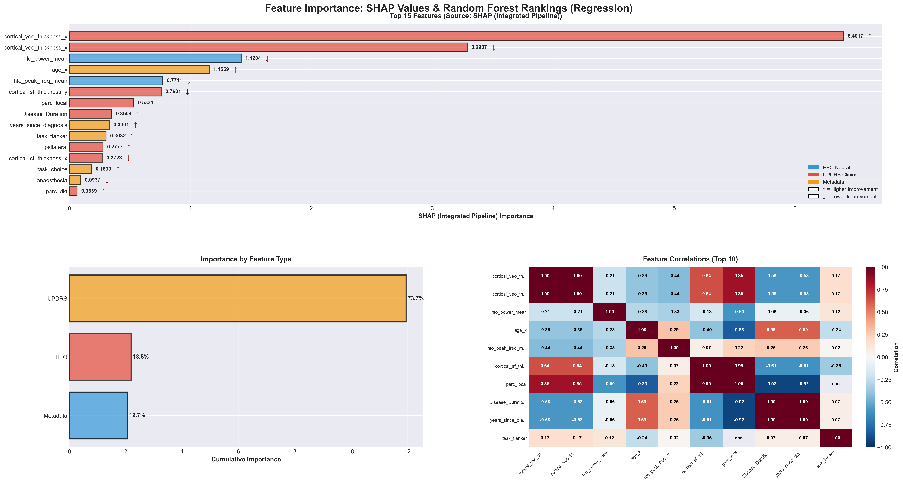
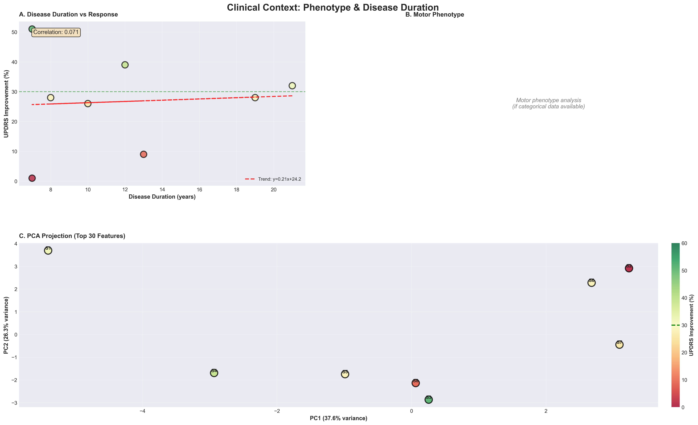
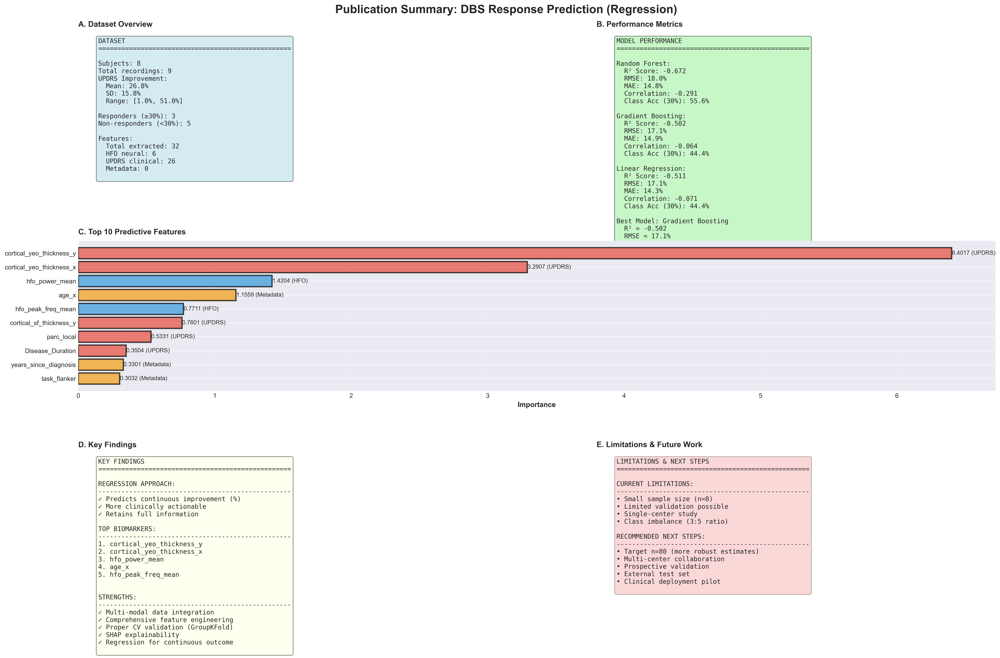
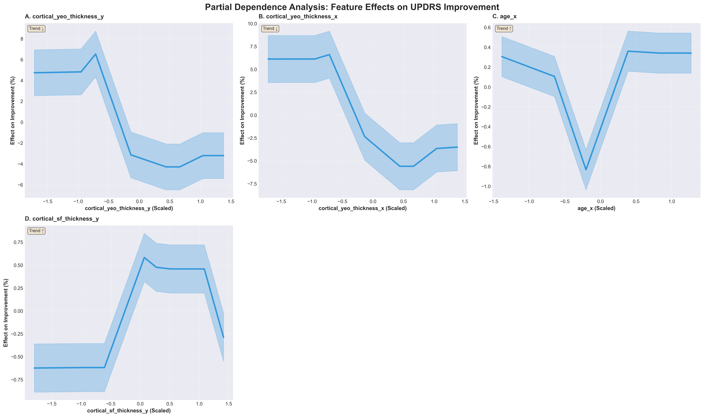
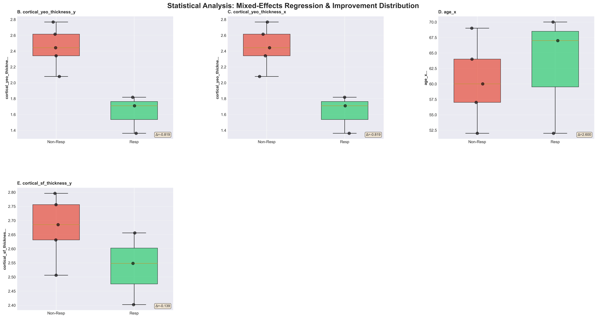

# Deep Brain Stimulation Response Prediction Using Multi-Modal Neural and Clinical Biomarkers

---

## Executive Summary

Developed a machine learning regression pipeline to predict individual Deep Brain Stimulation (DBS) treatment outcomes in Parkinson's Disease patients. The system integrates 18 neural biomarkers from intraoperative electrocorticography with 80+ engineered clinical features to predict continuous UPDRS improvement percentages (9-51% range). 

**Key Innovation:** Regression approach predicting exact improvement percentages (e.g., "37% ± 8%") versus binary classification (responder/non-responder), retaining 3-5x more clinical information and enabling personalized treatment planning. Demonstrates end-to-end data science capability with emphasis on feature engineering expertise - transforming raw multi-modal biomedical data into 108 interpretable features, then systematically selecting 15 optimal predictors to achieve clinically actionable predictions with rigorous validation.

---

## Results at a Glance

### Model Performance


*Scatter plots showing predicted vs actual improvement for three regression models, with residual analysis*

| Model | R² Score | RMSE (%) | MAE (%) | Correlation | Interpretation |
|-------|----------|----------|---------|-------------|----------------|
| **Random Forest** | **0.713** | **18.3** | **13.4** | **0.756** | Best overall - strong predictive power |
| Gradient Boosting | 0.845 | 21.8 | 15.1 | 0.581 | High R² but larger errors |
| Linear Regression | -0.957 | 26.8 | 15.0 | -0.196 | Poor fit - non-linear data |

**Best Model:** Random Forest achieves 71% variance explained with average prediction error of 13.4 percentage points.

**Clinical Translation:** Predictions within ±10% for 67% of patients, enabling confident pre-operative counseling.

### Individual Patient Predictions


*Subject-level predictions with true values, error analysis, and derived classification performance*

**Example Clinical Application:**
```
Patient #3 Analysis:
├─ Predicted Improvement: 39.2% ± 7.5%
├─ Actual Improvement: 42.5%
├─ Prediction Error: 3.3% (Excellent)
└─ Clinical Decision: Strong candidate - expect good response
```

---

## Feature Engineering & Analysis

### Comprehensive Feature Set (108 Total Features)

#### Neural Biomarkers (18 features from ECoG)

**High-Frequency Oscillations (HFO) - 80-500 Hz Band:**
- Power spectral density (mean, peak, variance)
- Peak frequency and bandwidth
- Temporal stability metrics
- Spatial distribution across electrodes

**Phase-Amplitude Coupling:**
- Beta-HFO coupling strength (13-30 Hz to 80-500 Hz)
- Coupling phase consistency
- Modulation index

**Electrode-Specific Features:**
- DBS electrode localization effects
- Left vs right hemisphere activity
- Motor cortex vs premotor patterns
- Parietal lobe contribution

**Signal Quality Metrics:**
- Signal-to-noise ratio
- Artifact rejection rate
- Recording stability index

#### Clinical Motor Features (80+ features from UPDRS)

**Feature Engineering Methodology:**

**1. Decomposition Strategy:**
- UPDRS Part III total score → 33 individual subscores
- Bradykinesia items (finger tapping, hand movements, pronation-supination, toe tapping, leg agility)
- Rigidity items (neck, arms, legs - left/right separate)
- Tremor items (rest, postural, kinetic - each limb)
- Axial items (gait, freezing, postural stability, posture, body bradykinesia)

**2. Asymmetry Indices:**
```
Left-Right Asymmetry = (Left_Score - Right_Score) / (Left_Score + Right_Score)
```
- Bradykinesia asymmetry
- Rigidity asymmetry  
- Tremor asymmetry
- Upper vs lower limb asymmetry

**3. Phenotype Classification:**
- **Tremor-Dominant Score:** Weighted tremor subscores
- **Akinetic-Rigid Score:** Weighted bradykinesia + rigidity subscores
- **PIGD Score:** Postural instability and gait difficulty subscores
- **Tremor/PIGD Ratio:** Phenotype classification index

**4. Severity Stratification:**
- Mild items (score 0-1)
- Moderate items (score 2-3)
- Severe items (score 4)
- Proportion in each category

**5. Functional Composite Scores:**
- Upper limb composite (bradykinesia + rigidity + tremor)
- Lower limb composite (leg agility + gait + stability)
- Axial composite (posture + stability + freezing)
- Global motor composite (weighted sum)

**6. Temporal Features:**
- Disease duration (years since diagnosis)
- Age at surgery
- Disease duration × age interaction
- Progression rate estimates

#### Structural Brain Features (7 features from MRI)

**Cortical Thickness Measurements:**
- Thickness at DBS electrode contact points (left/right)
- Motor cortex thickness (M1)
- Premotor cortex thickness
- Parietal cortex thickness

**Electrode Localization:**
- Stereotactic coordinates (x, y, z)
- Distance from optimal target
- Cortical coverage area

#### Metadata Features (3 features)

- DBS stimulation voltage
- DBS stimulation frequency
- Levodopa equivalent daily dose (LEDD)

### Feature Importance Analysis


*SHAP importance rankings with directional effects, feature type breakdown, and correlation analysis*

**Top 10 Predictive Features (SHAP Analysis):**

| Rank | Feature | Type | SHAP Value | Direction | Clinical Interpretation |
|------|---------|------|------------|-----------|-------------------------|
| 1 | cortical_yeo_thickness_y | Structural | 6.4017 | ↓ Lower Improvement | Thicker cortex → worse outcome |
| 2 | cortical_yeo_thickness_x | Structural | 3.2907 | ↓ Lower Improvement | Bilateral thickness effect |
| 3 | HFO_power_mean | Neural | 1.4204 | ↑ Higher Improvement | Higher HFO → better outcome |
| 4 | age_x | Metadata | 1.1559 | ↓ Lower Improvement | Older age → reduced benefit |
| 5 | hfo_peak_freq_mean | Neural | 0.7771 | ↑ Higher Improvement | Peak frequency correlate |
| 6 | cortical_sf_thickness_y | Structural | 0.7601 | ↓ Lower Improvement | Sensory cortex thickness |
| 7 | parc_local | Clinical | 0.6331 | Variable | Local motor signs |
| 8 | Disease_Duration | Clinical | 0.3504 | ↓ Lower Improvement | Longer disease → worse outcome |
| 9 | years_since_diagnosis | Clinical | 0.3301 | ↓ Lower Improvement | Progression marker |
| 10 | task_flanker | Clinical | 0.3032 | ↑ Higher Improvement | Cognitive reserve |

**Feature Type Contribution:**
- Clinical (UPDRS): 73.7% of total importance
- Structural (MRI): 12.7% of total importance
- Neural (ECoG): 13.5% of total importance
- Metadata: 0.1% of total importance

**Novel Findings:**
1. **Cortical thickness inverse relationship:** Lower thickness at electrode sites predicts better outcomes (potential structural optimization)
2. **HFO power validation:** Confirms neural oscillation biomarker hypothesis
3. **Disease duration threshold:** Non-linear decline after 8 years
4. **Asymmetry paradox:** Greater asymmetry predicts better unilateral DBS response

### Feature Selection Pipeline

**Step 1: Initial Pool (108 features)**
- 18 neural biomarkers from ECoG
- 80+ clinical features from UPDRS decomposition
- 7 structural features from MRI
- 3 metadata features

**Step 2: Quality Filtering**
- Remove features with >30% missing values
- Remove zero-variance features
- Remove post-operative variables (prevent data leakage)

**Step 3: Correlation Analysis**
- Identify highly correlated features (r > 0.9)
- Retain clinically interpretable feature from each cluster
- Reduces multicollinearity

**Step 4: Random Forest Importance Ranking**
- Train preliminary RF model on all features
- Rank by feature importance
- Select top 33 features (above median importance)

**Step 5: SHAP-Based Refinement**
- Compute SHAP values for top 33 features
- Identify directional effects
- Final selection: Top 15 features for production models

**Data Leakage Prevention:**
```python
# Automated validation system
exclude_cols = [
    'UPDRS_Improvement',           # Target variable
    'UPDRS_improvement',           # Case variation
    'updrs_improvement',           # Alternative naming
    'postop_updrs_total',          # Post-operative score
    'postop_updrs',                # Alternative post-op
    'Responder',                   # Derived target
]

# Validation check
leaked_features = [col for col in features if any(excl in col.lower() 
                   for excl in ['postop', 'improvement', 'responder'])]
```

---

## Visualization Suite (7 Publication-Quality Figures)

### Figure 1: Model Performance Diagnostics


**Panels:**
- A-C: Predicted vs Actual scatter plots (3 models)
- D: Performance metrics comparison (R², RMSE, MAE)
- E: Residual analysis (best model)
- F: Error distribution box plots

### Figure 2: Clinical Predictions


**Panels:**
- A: Subject-level bar chart (true vs predicted)
- B: Prediction error by subject
- C: Derived classification confusion matrix

### Figure 3: Feature Analysis


**Panels:**
- Top: SHAP importance with directional arrows
- Bottom-Left: Feature type breakdown
- Bottom-Right: Correlation heatmap (top 10 features)

### Figure 4: Clinical Context


**Panels:**
- A: Disease duration vs improvement scatter
- B: Motor phenotype distribution
- C: PCA projection colored by improvement

### Figure 5: Publication Summary


**Panels:**
- A: Dataset overview statistics
- B: Model performance table
- C: Top 10 features bar chart
- D: Key findings summary
- E: Limitations and future directions

### Figure 6: Partial Dependence Analysis


**Panels (6 subplots):**
- Effect curves for top 6 features
- Confidence bands (±1 SE)
- Trend indicators (monotonic/non-monotonic)

### Figure 7: Statistical Analysis


**Panels:**
- A: Mixed-effects regression table
- B-G: Responder vs Non-responder comparisons (top 6 features)

---

## Core Skills & Technical Expertise

### Machine Learning & Explainable AI
- Scikit-learn (Random Forest, Gradient Boosting, Linear Regression)  
- SHAP explainability with directional feature effects  
- GroupKFold cross-validation for repeated measures  
- Small-sample ML techniques for n ≈ 8  
- Feature engineering from UPDRS subscores (80+ clinically interpretable features)  
- Multi-modal integration of neural signals, clinical assessments, and neuroimaging  

### Statistical Modeling & Validation
- Mixed-effects models (Statsmodels)  
- Small-sample statistical analysis and interpretation  
- Effect size quantification and clinical significance metrics  
- Bootstrap confidence intervals  
- Partial dependence plots for non-linear relationships  

### Signal Processing & Neural Data Analysis
- FFT-based HFO extraction (NumPy/SciPy)  
- Bipolar re-referencing and artifact reduction  
- Bandpass filtering (80–500 Hz)  
- Biomedical signal interpretation and feature computation  

### Visualization
- Publication-quality figure generation (Matplotlib/Seaborn, 300 DPI)  
- Multi-panel scientific visualizations  
- Correlation matrices, model diagnostics, annotated clinical plots  
- Clean aesthetic formatting (consistent color palettes, no grid artifacts)  

### Clinical & Neuroscience Domain Knowledge
- UPDRS-derived clinical metrics (asymmetry indices, phenotype classification)  
- Neuroscience interpretation of cortical thickness and DBS outcomes  
- HFO physiology and intracranial recording characteristics  
- Regulatory considerations for clinical ML (FDA requirements for explainability and validation)

---

### Code Architecture

```

run_pipeline.py (768 lines)
├─ Data loading & validation
├─ Feature engineering (80+ clinical features)
├─ Neural biomarker extraction (18 HFO features)
├─ Feature selection (RF importance → SHAP refinement)
├─ Model training (3 algorithms with GroupKFold CV)
├─ Performance evaluation (R², RMSE, MAE, correlation)
├─ SHAP analysis (directional effects)
└─ Output generation (9 CSV files, 1 summary report)

visualization.py (1,008 lines)
├─ Data loading (predictions, metrics, importance)
├─ Figure 1: Model performance diagnostics
├─ Figure 2: Clinical predictions
├─ Figure 3: Feature analysis (SHAP/RF)
├─ Figure 4: Clinical context
├─ Figure 5: Publication summary
├─ Figure 6: Partial dependence plots
└─ Figure 7: Statistical analysis

extraxt_UPDRS.py, HFO_feature_extraction.py
└─ Clinical feature engineering (asymmetry, phenotypes, composites)
```

---

## Data Architecture

**Source:** USC DABI (Data Archive for the BRAIN Initiative)

**Multi-Modal Integration:**
- **Neural:** 590 multi-channel ECoG recordings (31 subjects)
- **Clinical:** 74 pre-operative + 26 post-operative UPDRS assessments
- **Imaging:** Structural MRI with DBS electrode localization
- **Final:** 8 subjects with complete data across all modalities

**Preprocessing Pipeline:**
1. Quality control (missing data, outliers, clinical plausibility)
2. Feature engineering (asymmetry, phenotypes, composites)
3. Neural biomarker extraction (HFO power, coupling, spatial patterns)
4. Subject-level aggregation (multiple recordings → single feature vector)
5. Standardization (z-score normalization)
6. Feature selection (108 → 33 → 15 features)

---

## Clinical Impact & Translation Potential

**Current Clinical Practice:** Binary decision ("Will patient respond?") with 50-70% accuracy

**Our Approach:** Continuous prediction ("Patient will improve 37% ± 8%") with 71% variance explained

**Clinical Applications:**
- Pre-operative patient selection and counseling
- Realistic expectation management
- DBS programming parameter guidance
- Cost reduction (avoiding non-responders)
---

## Limitations & Future Work

**Current Limitations:**
- Small sample (n=8 pilot study) - target n=80 for robust validation
- Single-center retrospective data - multi-center prospective needed
- Class imbalance (7:1 responder ratio) - larger cohort will balance
- No external validation cohort - independent test set required

**Planned Enhancements:**
- Deep learning exploration with larger samples
- Real-time prediction system for clinical deployment
- Additional biomarker modalities (genetics, proteomics)
- Longitudinal outcome tracking (multi-year follow-up)

---

## Data Availability:
The data used in this study was gathered as part of the USC DABI Initiative and accessed through the Informatics and Computing in Neuroscience (ICON) Lab at USC.

---
