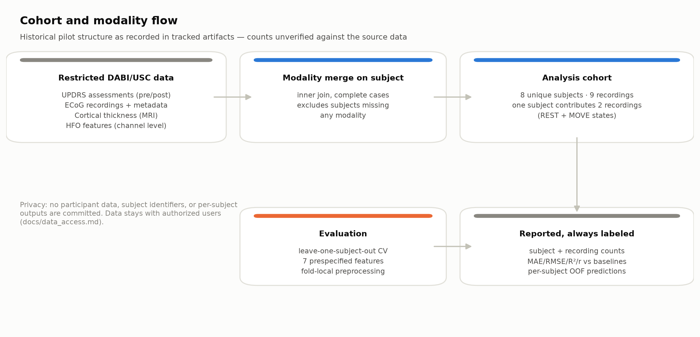
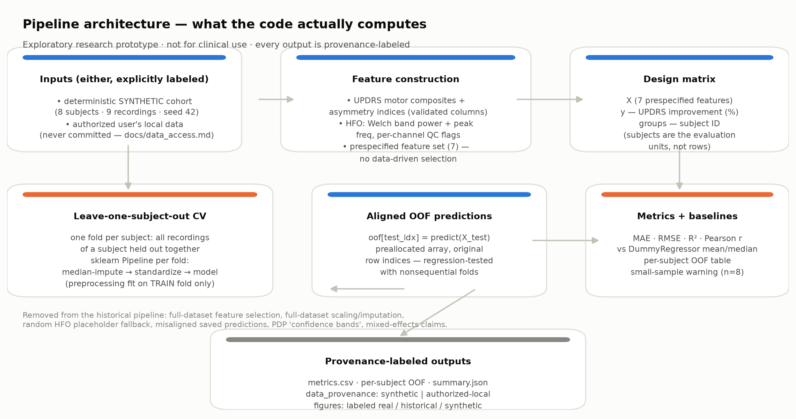
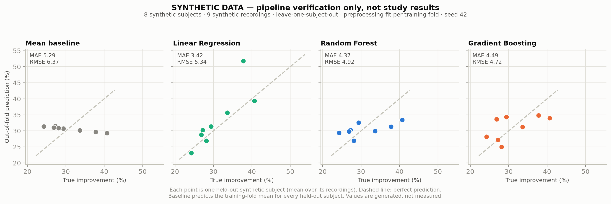

# CURVE-ICON-DBSO

**CURVE** — expansion not documented in the repository *[to be supplied by the owner]* ·
**ICON** — Informatics and Computing in Neuroscience Lab, USC ·
**DBSO** — Deep Brain Stimulation Outcome (prediction)

An exploratory, subject-grouped machine-learning analysis asking whether
intraoperative ECoG high-frequency oscillations (HFOs) and clinical measures carry
any signal about Deep Brain Stimulation outcome — on a pilot cohort of **8 subjects
(9 recordings)**.

> ### ⚠️ Exploratory research prototype — not for clinical use
> Retrospective, single-center, n = 8. No valid study performance estimate exists in
> this repository: the historical results were invalidated by a prediction-alignment
> bug plus data leakage, and the only runnable results here are on **synthetic**
> verification data. Nothing here supports clinical decision-making, counseling,
> patient selection, or DBS programming.

---

## What this repository is (30 seconds)

- **Question:** can HFO + clinical features relate to motor improvement (% UPDRS
  change) after DBS, measurable at pilot scale? *(Answer at this sample size: not
  reliably — and that is the honest result.)*
- **Data:** restricted USC DABI clinical + ECoG + imaging data, **not distributed
  here**; all runnable code paths are verified on deterministic synthetic data.
- **Correction story:** the original pipeline reported R² = 0.713 (README) while its
  own figures showed −0.672. Root cause found: fold-order predictions saved against
  original-row-order subjects. This repository contains the corrected evaluation,
  tests that pin it, and the invalid figures archived as documentation.
- **Status:** research prototype; negative/feasibility results expected and preserved.

## Research question

Do resting/task ECoG HFO features recorded from sensorimotor cortex, together with
routine clinical measures, carry measurable association with the magnitude of motor
improvement after DBS — and can any such association survive honest,
subject-grouped validation at n = 8? (See [docs/methodology.md](docs/methodology.md).)

## Dataset and cohort

| Item | Value |
|---|---|
| Source | USC DABI (Data Archive for the BRAIN Initiative), via the ICON Lab — **restricted; see [docs/data_access.md](docs/data_access.md)** |
| Modalities | UPDRS assessments (pre/post) · intracranial ECoG + recording metadata · cortical thickness (MRI) · HFO features |
| Cohort | **8 unique subjects, 9 recordings** — one subject contributes 2 recordings (REST + MOVE); remaining subjects contribute 1 |
| Counts in results | Every result reports both subject and recording counts |
| Privacy | No participant data, subject identifiers, raw signals, or per-subject outputs are committed; `data/`, `outputs/`, `*.csv`, `*.mat` are gitignored |

The 8/9 structure comes from tracked historical artifacts and is marked unverified
against the source data.



## Pipeline architecture



## Implemented feature extraction (complete list)

Per ECoG channel ([`src/curve_icon_dbso/hfo.py`](src/curve_icon_dbso/hfo.py)):

- 4th-order zero-phase Butterworth band-pass (default **80–500 Hz**), validated
  strictly below Nyquist;
- Welch PSD → **band power** and **peak frequency**;
- per-channel **QC status + failure reason** — failures are never zero-filled, and
  there is no random/placeholder fallback anywhere.

Per subject ([`src/curve_icon_dbso/features.py`](src/curve_icon_dbso/features.py)):

- mean of OK channels for the two HFO features;
- UPDRS-derived bradykinesia / rigidity / tremor composites per side and
  **asymmetry indices**; disease duration; age;
- a **prespecified set of 7 features** — fixed a priori, no data-driven selection.

**Not implemented, therefore not claimed:** phase-amplitude coupling, artifact
rejection, SNR, stability metrics, spatial-distribution summaries, bootstrap
confidence intervals, per-patient uncertainty. (The historical README's "18 neural
biomarkers" and "108 features" were unsupported — artifacts show 32 engineered
columns, 2 of them HFO-derived.)

## Validation design (corrected)

1. **Subjects are the evaluation units**: leave-one-subject-out CV — every fold
   holds out *all* recordings of one subject; no recording straddles train/test.
2. **Fold-local preprocessing**: median imputation + standardization inside an
   sklearn `Pipeline`, fit on each training fold only. No feature selection (the 7
   features are prespecified).
3. **Baselines**: `DummyRegressor` mean and median through the identical procedure.
   A model is not called useful unless it beats both.
4. **Aligned out-of-fold predictions**: preallocated array,
   `oof[test_idx] = pipe.predict(X_test)` — regression-tested with nonsequential
   fold indices (`tests/test_alignment.py`).
5. **Metrics**: MAE, RMSE, R², Pearson r + per-subject OOF predictions and errors.
6. **No tuning**: hyperparameters are fixed and documented; nothing is optimized
   against held-out subjects.

**Small-sample caveat (applies to everything below):** LOSO on 8 subjects yields
exactly 8 held-out predictions. R² and correlation are highly unstable at this size
(expected R² under the null is *negative*); a single subject can flip any ranking.

## Verified results

**No valid real-data performance estimate exists.** The historical numbers
(R² 0.713 / 0.845) were products of the misalignment + leakage defects and are
retracted; their figures are archived under
[`figures/archive/`](figures/archive/README.md) as documentation of the defect.

What *is* verifiable is the machinery, on synthetic data
(`figures/synthetic_oof_verification.png`; regenerate with the quick start below —
seeded, byte-identical across runs):

| Model (LOSO, synthetic cohort) | MAE | RMSE | R² | Pearson r |
|---|---|---|---|---|
| Mean baseline | 5.29 | 6.37 | −0.256 | — |
| Median baseline | 5.37 | 6.33 | −0.242 | — |
| Linear Regression | 3.42 | 5.34 | 0.116 | 0.813 |
| Random Forest | 4.37 | 4.92 | 0.249 | 0.556 |
| Gradient Boosting | 4.49 | 4.72 | 0.310 | 0.561 |

*Synthetic data with a planted linear signal — these numbers demonstrate that the
evaluation is correctly aligned and leakage-controlled; they say nothing about real
DBS outcomes.* All three models beat both baselines here **by construction** (the
generator plants a learnable signal); with 8 real subjects the honest expectation is
a null or uninterpretable result, and the corrected pipeline is designed to show
that rather than hide it.



## Why n = 8 cannot establish clinical utility

- Eight held-out predictions give confidence intervals so wide that no model
  comparison is meaningful; R² can be negative for a genuinely informative model.
- Selection effects from requiring complete multi-modal data are unquantified.
- REST vs MOVE, anesthesia, and medication state confounds are unmodeled.
- Any "top feature" ranking at this n is noise; the pipeline therefore refuses to
  rank features. See [docs/limitations.md](docs/limitations.md).

## Quick start (offline, no data required)

```bash
git clone https://github.com/oleeveeuh/CURVE-ICON-DBSO.git
cd CURVE-ICON-DBSO
python3.11 -m venv .venv && source .venv/bin/activate
pip install -e ".[dev]"

# deterministic synthetic end-to-end run (~seconds)
curve-icon-demo --output-dir outputs/synthetic_demo

# regenerate README figures
python scripts/make_figures.py
```

## For authorized data users

The real dataset is **not** in this repository. Obtain your own DABI/USC
authorization, comply with the Data Use Agreement, store data locally, then:

```bash
python scripts/run_hfo_extraction.py \
  --input-dir /your/local/path/all_subs_preprocessed_data \
  --output-csv /your/local/outputs/hfo_channels.csv \
  --aggregated-csv /your/local/outputs/hfo_subjects.csv \
  --band-low 80 --band-high 500 --fs-override 1200
```

Details, required citations, and DUA placeholders:
[docs/data_access.md](docs/data_access.md).

## Tests

```bash
pytest -q          # 39 offline tests; no private data needed
ruff check src tests scripts
```

Coverage includes: OOF alignment under nonsequential folds, subject-group
integrity, fold-local fitting, hand-calculated metrics, HFO detection on synthetic
signals, Nyquist violations, failure-vs-zero QC, malformed-input errors, and an
end-to-end determinism check. CI runs the suite on Python 3.11/3.12
([.github/workflows/ci.yml](.github/workflows/ci.yml)).

## Repository structure

```
src/curve_icon_dbso/   package: config, synthetic cohort, features, HFO, evaluation, reporting
scripts/               CLI entry points (demo, HFO extraction, figure generation)
tests/                 offline test suite (39 tests)
configs/               example YAML configuration
docs/                  data access, methodology, limitations
figures/               verified figures (+ archive/ of invalid historical figures)
legacy/                archived original scripts, known-buggy, superseded — do not run
```

## Responsible use

This code and its outputs are exploratory research artifacts. They must not be used
for patient care, counseling, cohort selection, or device programming, and must not
be presented as clinically validated. If you build on this work, preserve subject
-grouped evaluation, report baselines, label synthetic vs real results, and keep
participant data out of version control.

## Realistic future work

1. Re-run the corrected pipeline under DABI authorization and publish the honest
   n = 8 result (likely null) with per-subject OOF tables.
2. Grow the cohort via multicenter collaboration (~10² subjects) before any model
   comparison; pre-specify the primary analysis.
3. Replace band-power summaries with validated, artifact-controlled HFO detection.
4. Only then consider uncertainty quantification and interpretation tooling.

## Data citation and license

- **Data:** USC DABI via the ICON Lab; exact dataset identifier, contributing
  investigators, required citation, and DUA reference: **[to be supplied — see
  docs/data_access.md](docs/data_access.md)**.
- **Code license:** intentionally unset. The author must confirm institutional
  (USC) ownership terms before a LICENSE is added; absence of a license means all
  rights reserved by default. A code license would grant no rights to the
  underlying clinical data.

## Known limitations

Summarized in [docs/limitations.md](docs/limitations.md): n = 8 statistics,
unverified cohort counts, single-center selection effects, unmodeled state
confounds, band-power-only HFO features, and RNG determinism that is
version-dependent.
